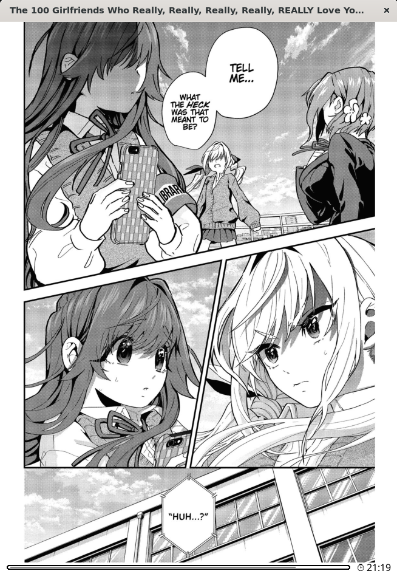

<p align="center">
  
  <br>
  <strong>Panels+</strong>
  <br>
  <span style="display:block;font-size:1.25rem;">Read manga and comics panel by panel, without losing the page and other panel zooming utilities!</span>
</p>

<table>
  <tr>
    <td align="center" width="50%">
      
      <br>
      <sub>Full-page reading stays one tap away.</sub>
    </td>
    <td align="center" width="50%">
      <video src="https://github.com/user-attachments/assets/446c71c6-a8f7-47ce-ae44-0fc885ed3241" controls width="420"></video>
      <br>
      <sub>Panel-by-panel navigation in KOReader.</sub>
    </td>
  </tr>
</table>

Panels+ is a KOReader plugin that improves manga and comic reading by replacing the default single-panel zoom flow with a direction-aware panel reader.

It keeps KOReader's native panel detection, then adds ordered panel navigation, manga/comic reading modes, swipe tuning, and gesture-friendly actions so pages feel smoother on e-readers.

## Download

Download the latest release from the [BetterPanels releases page](https://github.com/KristanLaimon/BetterPanels/releases/latest), unzip it, then follow the [installation steps](#installation).

If you want to build the plugin yourself instead, follow [building from source](#building-from-source).

## Features

<table>
  <tr>
    <td width="50%" valign="top" align="center">
      <video src="https://github.com/user-attachments/assets/446c71c6-a8f7-47ce-ae44-0fc885ed3241" controls width="420"></video>
      <br>
      <ul>
        <li>Panel-focused reading for manga, comics, manhwa, and other image-heavy books.</li>
        <li>Manga mode for right-to-left panel order.</li>
        <li>Comic mode for left-to-right panel order.</li>
      </ul>
    </td>
    <td width="50%" valign="top" align="center">
      <video src="https://github.com/user-attachments/assets/a2215310-da64-4e05-886f-27451c12fe7d" controls width="420"></video>
      <br>
      <ul>
        <li>Optional inverted swipe direction when navigation feels reversed on your device.</li>
        <li>KOReader gesture actions for toggling the plugin and switching modes quickly.</li>
      </ul>
    </td>
  </tr>
</table>

Additional details:

- Lightweight panel cache and prefetch settings tuned for e-reader performance.
- Built on KOReader's existing native panel detector instead of replacing it entirely.
- Adds zoom-friendly screenshot support while reading panels.

## Installation

After downloading or building the plugin, you should have this folder:

```text
panels_plus.koplugin
```

Copy the whole folder into your KOReader `plugins` directory. Do not copy only the files inside it.

Common plugin paths:

| Device | KOReader plugins directory |
| --- | --- |
| Kindle | `/mnt/us/koreader/plugins/` |
| Kobo | `.adds/koreader/plugins/` |
| Android | `/sdcard/koreader/plugins/` |
| Linux Flatpak | `~/.var/app/rocks.koreader.KOReader/config/koreader/plugins/` |

The final path should look like this:

```text
<koreader plugins directory>/panels_plus.koplugin
```

Restart KOReader after copying the folder.

## Building From Source

Clone or download this repository, then run:

```bash
./build.sh
```

On Windows PowerShell, run:

```powershell
.\build.ps1
```

The script creates:

```text
dist/panels_plus.koplugin
```

Copy that generated folder into your KOReader plugins directory, then restart KOReader.

## Gesture Actions

Panels+ registers these KOReader actions:

- `Panels+: toggle`
- `Panels+: manga/comic mode`
- `Panels+: set manga mode`
- `Panels+: set comic mode`

Use KOReader's gesture manager to bind them to taps, swipes, or other gestures.

## Why This Exists

When reading manga on an e-reader, some panels are too small to read comfortably on the full page. KOReader can detect panels, but the native flow often means zooming into one panel, leaving zoom, moving to the next panel, and repeating that cycle again and again.

Panels+ keeps the full page available while making panel navigation feel like a normal reading flow. It also adds screenshot support while zoomed into panels, so you can capture the exact panel view instead of only taking full-page screenshots.


## License
MIT License, check "LICENSE" file in this repository.
