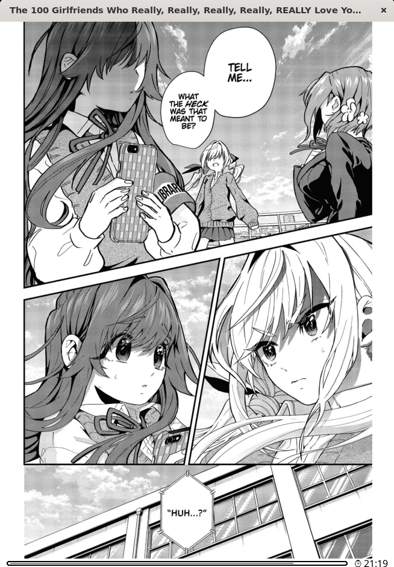

<p align="center">
  
  <br>
  <strong>Panels+</strong>
  <br>
  <span style="display:block;font-size:1.25rem;">Read manga and comics panel by panel, without losing the page and other panel zooming utilities!</span>
</p>

<table>
  <tr>
    <td align="center" width="50%">
      
      <br>
      <sub>Full-page reading stays one tap away.</sub>
    </td>
    <td align="center" width="50%">
      <video src="https://github.com/user-attachments/assets/446c71c6-a8f7-47ce-ae44-0fc885ed3241" controls width="420"></video>
      <br>
      <sub>Panel-by-panel navigation in KOReader.</sub>
    </td>
  </tr>
</table>

Panels+ is a KOReader plugin that improves manga and comic reading by replacing the default single-panel zoom flow with a direction-aware panel reader.

It keeps KOReader's native panel detection, then adds ordered panel navigation, manga/comic reading modes, swipe tuning, and gesture-friendly actions so pages feel smoother on e-readers.

## Download

Download the latest release from the [releases page](https://github.com/KristanLaimon/BetterPanels/releases/latest), unzip it, then follow the [installation steps](#installation).

If you want to build the plugin yourself instead, follow [building from source](#building-from-source).

## Features

<table>
  <tr>
    <td width="50%" valign="top" align="center">
      <video src="https://github.com/user-attachments/assets/446c71c6-a8f7-47ce-ae44-0fc885ed3241" controls width="420"></video>
      <br>
      <ul>
        <li>Panel-focused reading for manga, comics, manhwa, and other image-heavy books.</li>
        <li>Manga mode for right-to-left panel order.</li>
        <li>Comic mode for left-to-right panel order.</li>
      </ul>
    </td>
    <td width="50%" valign="top" align="center">
      <video src="https://github.com/user-attachments/assets/a2215310-da64-4e05-886f-27451c12fe7d" controls width="420"></video>
      <br>
      <ul>
        <li>You can customize the swipe direction when navigating trought the panels.</li>
        <li>Included KOReader gesture actions for toggling the plugin and switching modes quickly.</li>
      </ul>
    </td>
  </tr>
</table>

Other +Paneles features: (that for some reason aren't included in native koreader)
- Adds zoom-friendly screenshot support while reading panels.
- Finds panels on dark-background pages, where KOReader's own detector sees nothing.
- Pre-renders the next panel while you read the current one, so swiping is instant.

## Documentation

- [Architecture](docs/ARCHITECTURE.md) — how the plugin is put together, and what happens between a long hold and a panel on screen.
- [Panel detection](docs/DETECTION.md) — how panels are found, why there are two detectors, and every tuning knob.
- [Performance](docs/PERFORMANCE.md) — what each step costs, the memory budget, and how to measure it on your own device.

## Installation

After downloading or building the plugin, you should have this folder:

```text
panels_plus.koplugin
```

Copy the whole folder into your KOReader `plugins` directory. Do not copy only the files inside it.

Common plugin paths:

| Device | KOReader plugins directory |
| --- | --- |
| Kindle | `/mnt/us/koreader/plugins/` |
| Kobo | `.adds/koreader/plugins/` |
| Android | `/sdcard/koreader/plugins/` |
| Linux Flatpak | `~/.var/app/rocks.koreader.KOReader/config/koreader/plugins/` |

The final path should look like this:

```text
<koreader plugins directory>/panels_plus.koplugin
```

Restart KOReader after copying the folder.

## Building From Source

Clone or download this repository, then run:

```bash
./build.sh
```

On Windows PowerShell, run:

```powershell
.\build.ps1
```

The script creates:

```text
dist/panels_plus.koplugin
```

Copy that generated folder into your KOReader plugins directory, then restart KOReader.

## Gesture Actions

Panels+ registers these KOReader actions:

- `Panels+: toggle`
- `Panels+: manga/comic mode`
- `Panels+: set manga mode`
- `Panels+: set comic mode`

Use KOReader's gesture manager to bind them to taps, swipes, or other gestures.

## Why This Exists

I'm a manga fan and I read a lot in my e-reader and found out some panels are too small to read comfortably on the full page, then I tried using ko-reader native zoom, but then I need to zoom out, change panel, zoom-in, read the panel, zoom-out, zoom-in, read, and so on... (ugh!).

KOReader can detect panels, but the native flow often means zooming into one panel, leaving zoom, moving to the next panel, and repeating that cycle.

I wanted to create `Panels+` so (we manga-comic readers) could have the panel navigation we deserve with a normal reading flow!. 

This supports screenshots while zoomed into panels, so you can capture the exact panel view instead of only taking full-page screenshots, and use them as screen savers, book covers, anything you want.


# Contributions?
Project is actually stable, and personally tested in:
  - Kindle 12th Gen

I don't see any more options to include, but contributions are welcome for:
  - edge-cases bugs fixes
  - performance improvements
  - device-specific bugs fixes (this would help a lot)

Thanks for using the plugin or at least, taking a look into this repo.

## License
MIT License, check "LICENSE" file in this repository.
