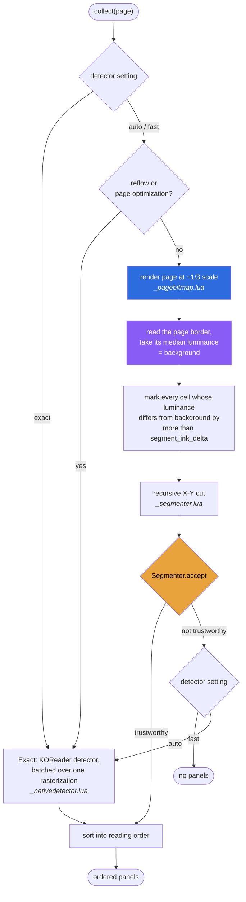
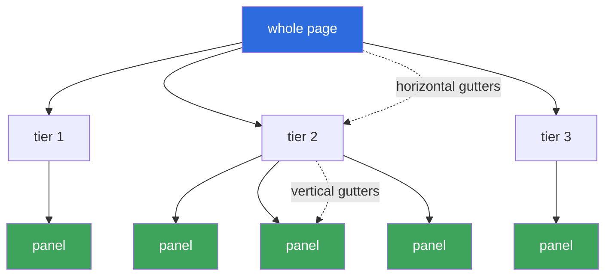
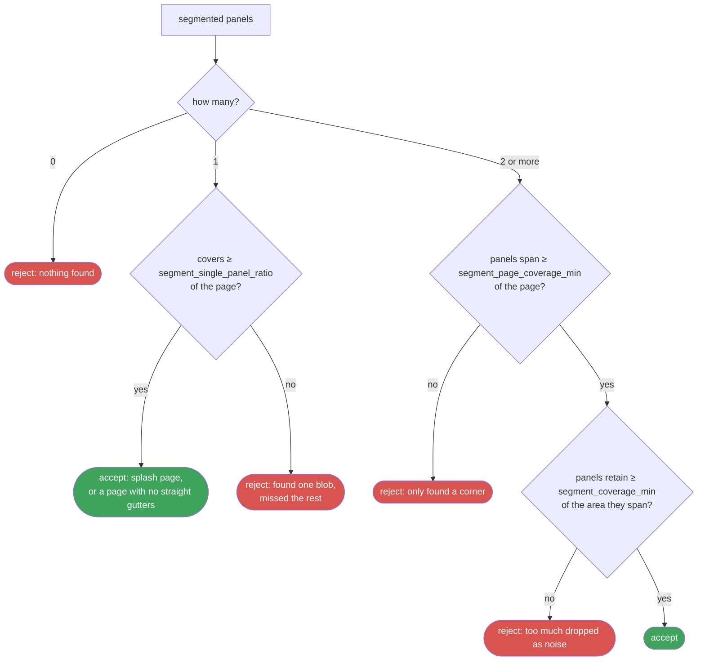
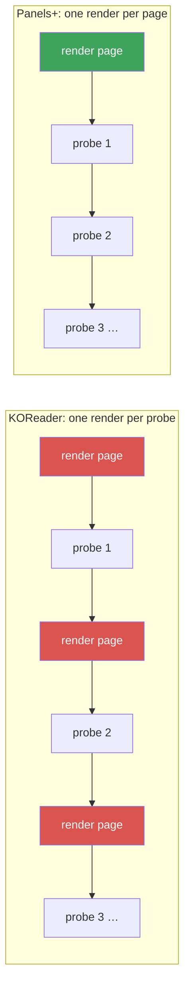
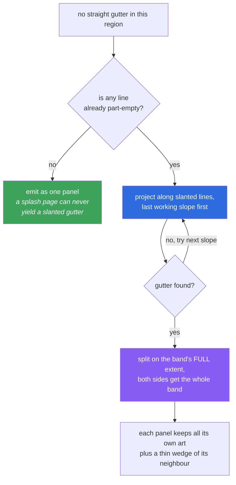

# Panel detection

How Panels+ decides where the panels on a page are, why there are two detectors,
and which knobs change the result.

See also: [MODES.md](MODES.md) for the reader-facing names of the modes this
document describes, [ARCHITECTURE.md](ARCHITECTURE.md),
[PERFORMANCE.md](PERFORMANCE.md).

## Two detectors, two failure modes

Neither available detector is good enough alone, and they fail in different
places — which is exactly why the default runs one and falls back to the other.

| | Fast mode (`fast`) | Exact mode (`exact`) |
| --- | --- | --- |
| Cost per page | one render at ~1/3 scale | one full-resolution rasterization |
| Panels found per pass | all of them | one per probe point |
| Dark backgrounds | works | **fails** |
| Tilted gutters (up to ~6°) | works | **fails** |
| Interlocking / diagonal layouts | **cannot split them** | often handles them |
| Reflow / page-optimization modes | unavailable | works |

### Why the KOReader detector can't see a dark page

`KoptInterface:getPanelFromPage` thresholds against *white* — the k2pdfopt code
behind it looks for blank light-coloured bands and treats them as the gaps
between panels. It has a white threshold and no inverse, and there is no way to
hand it a pre-inverted bitmap.

So on a page printed white-on-black there are no white gutters to find, and
detection collapses. This is not a tuning problem; it needs a different detector.

## The segmenter pipeline



### Background is measured, not assumed

This one step is what makes dark pages work. The outer ~1% ring of the page is
its own paper or its inked backdrop — never panel content — so the median
luminance of that ring is a reliable reference for what "empty" looks like on
*this* page.

Everything downstream is then relative:

```
ink  ⇔  |luminance − background| > segment_ink_delta
```

A white page yields `background ≈ 255` and marks dark strokes as ink. A black
page yields `background ≈ 0` and marks light strokes as ink. **The two produce
identical ink maps**, so the rest of the pipeline never learns which kind of page
it is looking at.

### The recursive X-Y cut

Comic pages are laid out as nested bands: a page splits into tiers, a tier splits
into panels, and the separators are gutters of bare background. Slicing on the
widest empty band, over and over, reproduces exactly that structure.

For each region: count ink per row and per column, trim to the ink bounding box,
find the widest *interior* run of near-empty lines, split there, and recurse.



Three details matter more than they look:

- **Interior gutters only.** A run of empty lines touching the edge of a region is
  a margin, not a separator between two siblings. Splitting there produces one
  empty half. Margins are removed by the trim step instead.
- **Near-empty, not empty.** A line counts as gutter if its ink is at or below
  `segment_gutter_ink_ratio` of the region's width. Scan noise, JPEG ringing and
  dust would otherwise turn every real gutter into a non-gutter.
- **Horizontal splits win ties.** Tiers stack vertically far more often than
  panels sit in full-height columns, so preferring row cuts on equal-width
  gutters follows the usual page structure.

Rectangles come back in map cells and are scaled to native page coordinates, then
grown by one cell in every direction: at 1/3 scale a single cell is several page
pixels, and without the margin the crop shaves the outermost artwork.

## Knowing when the cut is wrong

An X-Y cut can only separate panels a straight line can separate. Diagonal splits
and interlocking layouts have no such line. `Segmenter.accept()` catches those so
the result is handed to the other detector instead of shown as-is:



The single-panel branch is deliberately generous. One rectangle spanning most of
the page is the right answer twice over: it is what a splash page *is*, and it is
also the best either detector can do on a page with no straight gutters. Falling
back there would spend a full-resolution render to arrive at the same rectangle.
A lone *small* rectangle is a different story and does get a second opinion.

## The native detector, batched

When the segmenter declines, `_nativedetector.lua` runs KOReader's detector — but
not the way KOReader does.

`Document:getPanelFromPage()` is the only uncached probe in `KoptInterface`:
every call builds a context, rasterizes the whole page at full resolution, probes
one point, and discards the rasterization. Probing a grid that way costs one page
render per point.

Panels+ drives the same primitives with the loop moved inside the rasterization:



Probes run in a reading-order-aware plan — the hold position first, then the page
centre, then likely reading-path cells, then the full grid — and any point
already inside a discovered panel is skipped.

If building the shared context fails for any reason, the module falls back to
KOReader's own entry point — one full-resolution render per probe, up to the
whole grid. Both the shared-context attempt and that fallback are skipped
outright when free memory is below `native_detect_min_free_bytes`: a
full-resolution rasterization is this plugin's single largest allocation, and
retrying with ~29 of them right after one already failed is how a
low-memory device goes from tight to OOM-killed. When skipped, the page is
reported as having no panels, the same outcome as a segmenter rejection with
no native fallback available.

## Tuning

All values live in `src/_settings.lua`. Existing installs pick up new defaults
through `performance_profile_version`.

| Setting | Default | Effect |
| --- | --- | --- |
| `detector` | `"auto"` | `auto` fast with fallback, `fast` only, `exact` only. Also on the viewer's mode button — see [MODES.md](MODES.md) |
| `segment_target_width` | `480` | Ink-map width. See the note below before changing it |
| `segment_ink_delta` | `40` | Luminance distance from background counted as ink. Raise for noisy scans, lower for faint art |
| `segment_gutter_ratio` | `0.005` | Shortest gutter, as a fraction of the map's smaller side. Raise if panels are being over-split |
| `segment_gutter_ink_ratio` | `0.005` | Ink a line may carry and still count as empty. Raise for dusty scans |
| `segment_min_panel_area` | `0.005` | Smallest panel, as a fraction of page area. Rejects specks |
| `segment_min_panel_side` | `0.03` | Smallest panel side. Rejects slivers |
| `segment_max_depth` | `6` | Recursion limit, so up to 64 panels |
| `segment_max_panels` | `40` | Hard cap per page |
| `segment_coverage_min` | `0.5` | Least share of the spanned area the panels must retain |
| `segment_page_coverage_min` | `0.4` | Least share of the page the panels must span |
| `segment_single_panel_ratio` | `0.6` | Least share of the page a lone panel must cover to be believed |
| `segment_shear` | `true` | Look for slanted gutters when no straight one exists |
| `segment_shear_max_depth` | `4` | Deepest recursion level allowed to search for slanted gutters |
| `segment_shear_trigger` | `0.35` | How empty a line must already be before a slanted search is worth running |
| `segment_shear_step` | `2` | Sample every Nth line during a slanted search |
| `panel_grid_cols` / `panel_grid_rows` | `4` / `7` | Native detector probe grid |
| `native_detect_min_free_bytes` | `100MB` | Free memory below which native (Outline) detection is skipped entirely |
| `panel_bleed_ratio` / `panel_bleed_min` | `0.08` / `8` | Crop padding in loose crop mode |

### Resolution and gutter width are one setting, not two

`segment_gutter_ratio` is a fraction of the **map**, so it stays a fixed fraction
of the *page* no matter what resolution the map is built at. Raising
`segment_target_width` on its own therefore detects no extra gutters — the
minimum gutter grows in cells by exactly as much as the map does.

Both have to move together. Measured against rendered pages with 4px panel
borders and a realistic ink distribution, splitting a row of three panels:

| Map width | `gutter_ratio` | Minimum gutter | Narrowest gutter split |
| --- | --- | --- | --- |
| 320 | 0.012 | ~15px | 24px |
| 320 | 0.005 | ~10px | 16px |
| 480 | 0.012 | ~17px | 24px |
| **480** | **0.005** | **~7px** | **8px** |
| 640 | 0.006 | ~8px | 8px |

480 / 0.005 is the default: it splits every gutter width tested without
over-splitting splash pages, grids or full-height columns, at 2.25× the scan
cost of 320. 640 buys nothing extra for 4× the cost.

### Panels that are not square

Panel edges are rarely drawn exactly square, and the straight cut is far less
tolerant of that than it looks: a gutter tilted by **two degrees** already leaves
no column empty from top to bottom, so a row of panels comes back grouped.

When no straight gutter is found, the cut projects along slanted lines instead,
over a ladder of 2 to 8 degrees either way:



Three details carry this:

- **Every candidate is tried, not just the widest.** Projecting a slanted band
  back onto the axis widens it by the drift, which often makes the widest
  candidate unusable while a narrower one is fine. Taking only the widest also
  made the search keep re-finding the gutter it had just split on.
- **Both children get the whole band.** Splitting at the band's inner edge would
  shave a corner off each panel; giving both the full band means a thin wedge of
  the neighbour shows instead, which reads as ordinary panel bleed.
- **The search is gated.** It only runs when some line already looks part-empty,
  so pages that can never produce a slanted gutter skip it entirely.

Measured on rendered pages, a row of three splits correctly from 0 to 6 degrees.
At 7 to 8 degrees it tends to over-split, producing one panel too many rather
than one grouped blob.

Ink tolerance is deliberately *not* loosened for this search. Loosening it was
tried and collapsed 22 of 23 test layouts, exactly as it does for straight cuts.

### Known limitation: panels with no gutter

Some pages separate panels with a single shared border line and no background
gap at all. There is no empty band to find, so the cut merges them — and the
native detector, which also looks for blank bands, cannot split them either.
Such a row is currently returned as one panel.

## Diagnosing a page

Turn on **Panels+ → Log panel timings** and reopen the page, and you'll see
which path ran and, when the segmenter declines, why. This goes through
KOReader's own `logger.info`, so you'll find it in KOReader's log —
`crash.log`, next to your KOReader install directory, not anywhere inside the
Panels+ plugin folder. Every line this plugin emits starts with the prefix
`[Panels+]`, so you can grep/filter the logs easily — e.g.
`grep '\[Panels+\]' crash.log`. See
[PERFORMANCE.md → Measuring on your device](PERFORMANCE.md#measuring-on-your-device)
for more on the log format and where `crash.log` lives on each platform.

```
[Panels+] page bitmap 74ms (480x720 bb8 bg=12 inverted ink=38%)
[Panels+] segment 48ms (6 panels)
```

`bg=12 inverted` confirms the page was read as dark-background. A rejection looks
like:

```
[Panels+] segmenter rejected: single partial panel
[Panels+] native detect 780ms (5 panels from 29 probes, 1 page render)
```

If a page detects badly, the setting to reach for first is `detector` — or,
from an open panel, the mode button described in
[MODES.md](MODES.md#where-to-change-it). Forcing Gutter (`fast`) or Outline
(`exact`) tells you immediately which one is misreading the page, before you
touch any tuning value in the table above.
