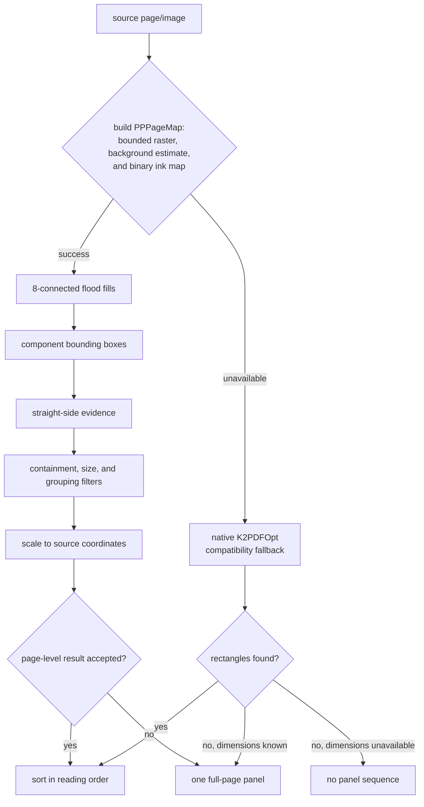

# Panel detection

Panels+ exposes one panel-detection mode: **Deep mode**. Internally it is the
`components` pipeline implemented by `_pagebitmap.lua` and
`_componentdetector.lua`. No alternate detector is selectable in the current
code.

This document describes the image-processing problem, the data flowing through
the pipeline, the heuristics used to turn pixels into panel rectangles, and the
failure behavior. Start with [INTRO.md](INTRO.md) if terms such as binary image,
connected component, or bounding box are unfamiliar.

## Detection is geometry recovery, not semantic recognition

The detector does not identify characters, text, or narrative content. It
assumes only that comic panels tend to create large connected regions whose
outer boundaries contain long straight segments. Its task is to infer a list
of rectangles from those visual conventions.

This distinction explains both its efficiency and its limits. A deterministic
flood fill over a 480-pixel-wide map is cheap enough for low-end e-readers and
requires no model files, but an unframed collage may contain no geometric
signal that distinguishes “panel” from “artwork.”

## One mode, two source backends

The format changes how pixels enter the algorithm, not which algorithm runs.

| Backend | Typical formats | Detection input | Output coordinates |
| --- | --- | --- | --- |
| **Fixed page** | CBZ, CBR, PDF, DjVu | page rendered at bounded resolution | native document-page space |
| **Embedded image** | EPUB, KEPUB, MOBI | decoded image resampled to bounded resolution | original image space |

Both inputs become the same `PPPageMap`, pass through `ComponentDetector`, and
are sorted by the same geometry code. Embedded images need a separate path
because a reflow page's coordinates describe laid-out text, not the pixels of
the image inside it.

## Pipeline overview



The fallback on the diagram is a full-page rectangle, not a switch to another
reader mode.

## 1. Build a bounded raster

For a fixed page, `PageBitmap.build()` asks KOReader for native dimensions and
renders at:

```lua
zoom = math.min(1, segment_target_width / native_width)
```

The current target width is 480 pixels. The algorithm never enlarges a source.
If a renderer ignores the requested zoom, the code subsamples the returned
buffer rather than scanning every full-resolution pixel.

For an embedded image, `PageBitmap.buildFromBlitbuffer()` resamples within a
480-by-960 bound while preserving aspect ratio. If allocating that temporary
raster would violate the memory floor, it falls back to bounded sparse
sampling. The retained original image is still used for final crops.

Reduced resolution is a design parameter. It removes detail that the detector
does not need, bounds runtime by map area, and smooths some scan noise. It can
also erase extremely thin or low-contrast borders, which is one unavoidable
precision tradeoff.

## 2. Estimate background and classify ink

The outer page ring is sampled into per-channel histograms. Their medians form
the estimated background color. Medians are used instead of means because a
few border marks should not pull the estimate far from the page substrate.

For a grayscale pixel `p` and estimated background `b`:

```text
ink = |p - b| > segment_ink_delta
```

The RGB path uses the largest absolute channel difference. With the default
threshold of 40, sufficiently different pixels become `1` in a row-major
`uint8_t[w*h]` buffer; everything else remains `0`.

This relative test is what makes dark and colored backgrounds possible. It
does not assume that background is white. A special check prefers white when a
mid-tone outer border surrounds clear white separators, preventing a printed
page frame from being mistaken for the paper color.

At this point meaning has been intentionally discarded. The map preserves
connectivity and contrast, not texture, color, or object identity.

## 3. Enumerate connected ink components

`ComponentDetector.segment()` makes one row-major pass over the map. For each
unvisited ink cell it runs a breadth-first search over the 3-by-3 neighborhood,
which is 8-connectivity:

```text
(x-1,y-1) (x,y-1) (x+1,y-1)
(x-1,y  ) (x,y  ) (x+1,y  )
(x-1,y+1) (x,y+1) (x+1,y+1)
```

Diagonal contact therefore joins regions. This is useful when a tilted or
anti-aliased border would be disconnected under 4-connectivity, but it can also
join two objects that touch only at a corner.

The traversal maintains four extrema, so each component immediately yields an
axis-aligned bounding box. Components below the initial floors are discarded:

- width less than 2% of map width;
- height less than 2% of map height;
- bounding-box area less than 0.2% of map area.

Those constants are local to `_componentdetector.lua`; they are not separate
reader modes or learned parameters.

### Why reusable FFI arrays matter

The visited flags and BFS queue have `O(w*h)` capacity. Storing them as Lua
tables would create large numbers of boxed values and put repeated pressure on
the garbage collector. Instead, `scratch_seen` is a `uint8_t[]` and
`scratch_queue` is an `int32_t[]`. They are allocated once, enlarged only when
necessary, zeroed with `ffi.fill`, and released by
`ComponentDetector.clearScratch()` during teardown.

The algorithmic complexity remains linear in the map size; the representation
changes constants and memory behavior substantially on an e-reader.

## 4. Measure straight-frame evidence

A bounding box is only a candidate. Text, a face, or a speech balloon may also
form a substantial connected component. Panels+ distinguishes them using the
shape of the component near its extrema.

During flood fill, `frameSides()` constructs four profiles:

- leftmost and rightmost ink `x` for each row;
- topmost and bottommost ink `y` for each column.

`lineSupport()` chooses several well-separated sample pairs from a profile,
fits a slope through each pair, and counts how much of the profile lies within
a tolerance of that line. A side is supported when the best fit covers at least
80% of its span. Slopes with absolute value above 0.35 are rejected.

The method is intentionally robust rather than exact:

- a tilted straight border can pass;
- a speech balloon interrupting one corner need not destroy an otherwise long
  straight side;
- a curved or irregular contour is unlikely to support one line over most of
  its extent.

For small boxes, `hasFrame()` performs an additional perimeter-band check and
requires strong ink coverage on all four sides. This reduces false positives
from isolated letters and faces.

## 5. Apply structural candidate policy

The detector makes several passes over the component boxes.

### Containment suppression

A candidate fully contained by a larger candidate is removed. In a framed
panel, interior speech, faces, and caption boxes are often separate components;
the outer frame should own that region.

This can suppress a legitimate inset panel. That is a known heuristic tradeoff,
not an implementation accident: containment alone cannot reveal narrative
intent.

### Small-candidate evidence

A candidate narrower than 10% of page width, shorter than 10% of page height,
or smaller than 1% of page area must have all four frame sides or pass the
perimeter check. Large candidates are allowed with weaker evidence because
large framed artwork often has breaks where balloons or figures cross a border.

### Framed and floating regions

Candidates with at least one supported side are treated as framed by default.
Unframed components may be joined to a framed neighbor when they overlap at
least 70% of the floating box's height and lie within 8% of map width
horizontally. Otherwise, floating boxes are grouped by how many framed regions
sit above them.

This grouping is a layout heuristic. It attempts to recover artwork separated
from a broken frame without promoting every isolated object into its own panel.

### Optional enclosed-background recovery

The implementation contains an experimental `component_holes` branch. It
inverts the ink map, finds sufficiently large enclosed background components,
and admits aligned holes as extra candidates. It is off unless explicitly set
in configuration and is not a separate mode.

## 6. Scale boxes back to source coordinates

Flood-fill boxes use detection-map cells. The final rectangles use the original
page or image coordinate system:

```text
source_x = map_x * scale_x
source_y = map_y * scale_y
```

Each box is expanded by one map cell before scaling and clamped to the native
bounds. The expansion compensates for quantization at reduced resolution so a
crop is less likely to shave off its outer frame.

`scale_x` and `scale_y` are kept separately. Assuming uniform scale would be a
latent bug whenever raster dimensions are rounded independently.

## 7. Validate the set as a page layout

`ComponentDetector.detectPage()` passes its rectangles to
`Segmenter.accept()`. The module name is historical; this function is a
detector-independent page-level validator still used by Deep mode.

It checks:

- an empty result is rejected;
- one rectangle is accepted when it covers at least 60% of the page, or
  contains at least 70% of the page's ink;
- multiple rectangles must collectively span at least 40% of the page;
- their total area must fill at least 50% of that collective bounding extent;
- configurations matching known page-furniture patterns are rejected;
- more than `segment_max_panels` (40) candidates is rejected before validation.

On rejection, the component detector returns a single rectangle covering the
native source. It does not rerun another reader-selectable mode.

## 8. Sort in reading order

Detection has no inherent narrative order. `Geometry.sortReadingOrder()`
applies the selected reading convention after rectangles are accepted:

- Manga mode: right-to-left flow;
- Comic mode: left-to-right flow.

Reading mode is therefore a permutation of the result, not a different vision
algorithm. The cache separates reading modes because the same rectangles have a
different sequence.

## Internal native compatibility fallback

`PanelCollector.collect()` tries to build the reduced map first. If it succeeds,
the component result is final, including its possible full-page rectangle. The
native path is attempted only when map construction itself returns `nil`, such
as when:

- fixed-page rendering fails or dimensions are invalid;
- KOReader reflow is active for that fixed document;
- KOReader page optimization prevents a coordinate-compatible small render;
- an embedded image cannot be mapped.

`_nativedetector.lua` uses KOReader's K2PDFOpt/Leptonica detector. For fixed
pages it probes a reading-aware grid while attempting to share one
full-resolution rasterization. If that batched path fails, it can use KOReader's
one-render-per-probe API. For embedded images it supplies the retained
BlitBuffer to a KOPT context and extracts components in image space.

Both paths check a 100 MB free-memory floor plus an estimated working set. If
the guard fails, they return no rectangles; the caller uses a full-page result
when source dimensions are available.

This fallback is deliberately described as an implementation detail of Deep
mode. Users cannot select `exact`, `auto`, or `fast`: settings migration and
setters normalize detector values to `components`.

## Current tuning values

Settings retain the `segment_` prefix for compatibility with older versions.
That prefix does not mean the legacy segmenter is the active detector.

| Setting | Default | Deep-mode effect |
| --- | --- | --- |
| `segment_target_width` | `480` | maximum fixed-page map width; embedded images also fit within twice this height |
| `segment_ink_delta` | `40` | minimum background-relative channel difference counted as ink |
| `segment_max_panels` | `40` | candidate-count safety cap |
| `segment_coverage_min` | `0.5` | minimum fraction of the collective extent occupied by accepted boxes |
| `segment_page_coverage_min` | `0.4` | minimum page fraction spanned by a multi-panel result |
| `segment_single_panel_ratio` | `0.6` | page fraction that makes one detected rectangle trustworthy by area |
| `native_detect_min_free_bytes` | `100 MB` | safety floor for the internal full-resolution fallback |

Two optional keys are read directly by `ComponentDetector` but are not present
in the standard settings menu:

| Optional key | Implicit default | Effect |
| --- | --- | --- |
| `component_frame_min` | `1` | minimum supported sides for the framed-candidate group |
| `component_holes` | `false` | enable experimental enclosed-background recovery |

Changing thresholds without fixtures is risky. A value that fixes one page may
shift false positives or false negatives across a whole corpus. Prefer adding a
minimal fixture and asserting both the rectangles and their reading order.

## Known ambiguities

### Touching or borderless panels

Two panels separated only by a shared stroke may be one connected ink
component. Conversely, a long straight line inside a single illustration can
look like a panel boundary. At reduced resolution there may be no feature that
reliably distinguishes those cases.

### Insets versus interior objects

Containment suppression removes common false positives inside a frame, but a
real inset panel is also a contained rectangle. Supporting insets robustly
requires additional layout evidence.

### Broken and highly stylized borders

The grouping pass tolerates some broken frames, but pages whose panel boundaries
are mostly implied by composition rather than ink can collapse to a full-page
view. Strong curves can also fail the straight-side prior.

### Low contrast and scan artifacts

Background-relative thresholding handles illumination and page color better
than a white threshold, but faint borders near the substrate color may vanish.
Dust or compression artifacts can create accidental connectivity.

## Diagnosing a page

Enable **Panels+ → Enable debugging logs**, reproduce the page, and inspect
KOReader's `crash.log`. Filter for `[Panels+]`.

Representative lines include:

```text
[Panels+] page bitmap 74ms (480x720 bb8 bg=247 ink=22%)
[Panels+] native detect 810ms (6 panels from 29 probes, 1 page render)
[Panels+] native detect skipped: low memory (...)
```

`page bitmap` confirms that the primary Deep input was built. A `native detect`
line means map construction was unavailable and the internal compatibility
fallback ran. It does not mean that a different user mode was selected.

For correctness work, inspect the intermediate map and component boxes in a
test fixture rather than tuning from the final crop alone. The benchmark and
dataset helpers under `tests/` are designed for comparing precision, recall,
and reading order across more than one page.
