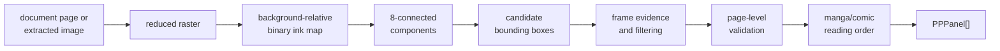
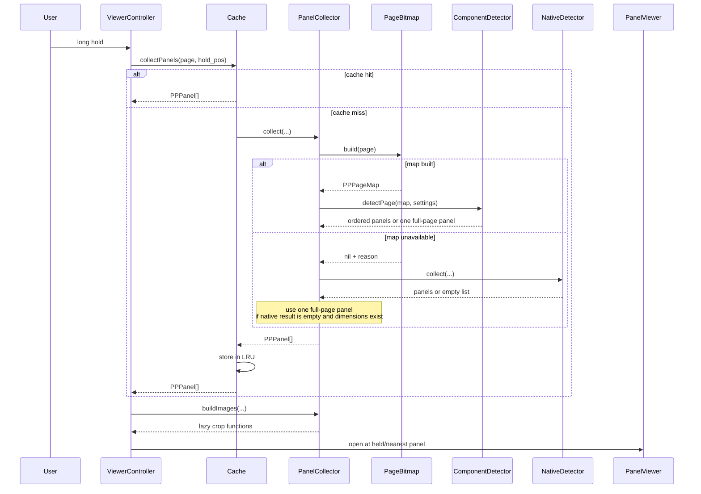

# Introduction

This is the technical on-ramp to Panels+. It assumes that you can read Lua and
are comfortable with ordinary algorithms and data structures, but it does not
assume prior computer-vision knowledge. The goal is to give you a working
mental model before you enter the implementation details.

See [ARCHITECTURE.md](ARCHITECTURE.md) for lifecycle and call graphs,
[DETECTION.md](DETECTION.md) for the complete vision pipeline,
[MODES.md](MODES.md) for the single Deep detection mode, and
[PERFORMANCE.md](PERFORMANCE.md) for runtime and memory costs.

## What the plugin changes

KOReader already has panel zoom. A long hold finds the panel under the pointer
and opens that one crop. Panels+ intercepts that entry point and turns it into
an ordered sequence:

1. detect all usable panel rectangles on the page;
2. sort them for manga or Western-comic reading order;
3. open the rectangle nearest the hold position;
4. move through the list with taps, swipes, keys, or external page turners;
5. prefetch the next page's rectangles and continue across page boundaries.

Panels+ patches `ReaderHighlight:onHold` to detect embedded reflow images and
`ReaderHighlight:onPanelZoom` for the fixed-page path. Both original methods are
restored on shutdown. It does not fork KOReader's document renderer.

## The central data model

The detector does not try to understand characters, speech, perspective, or
story structure. Its output is deliberately small:

```lua
---@class PPPanel
---@field x number -- left edge in source coordinates
---@field y number -- top edge in source coordinates
---@field w number -- width
---@field h number -- height
```

A page becomes an array of `PPPanel` rectangles. Detection decides which
rectangles exist; `src/_geometry.lua` decides their order; the viewer later
renders each rectangle on demand. Keeping these responsibilities separate is
important: changing manga/comic order must not change what the detector sees,
and changing crop style must not mutate the detected bounds.

## A small computer-vision vocabulary

Panels+ uses classical image processing rather than a learned model. The main
terms are:

- **Raster**: a rectangular grid of pixels. A PDF page is rendered into a
  raster before it can be analyzed.
- **Binary image / ink map**: one byte per sampled location, classified as
  background (`0`) or ink (`1`). This discards color detail and preserves the
  topology needed by the detector.
- **8-connectivity**: a cell is adjacent to its horizontal, vertical, and
  diagonal neighbors. A flood fill over those eight neighbors groups touching
  ink into a connected component.
- **Connected component**: one maximal set of connected ink cells. A drawn
  panel frame and the artwork touching it often form one large component.
- **Bounding box**: the smallest axis-aligned rectangle containing a component.
  It is a candidate panel, not proof of one.
- **Feature / evidence**: a measurable property used by a heuristic. Here the
  most important evidence is long, nearly straight support along the four sides
  of a candidate box.
- **False positive**: a speech balloon, face, text block, or decorative rule
  accepted as a panel.
- **False negative**: a real panel missed or merged with another one.
- **Heuristic**: a rule that works for the visual conventions of comic pages
  but is not mathematically guaranteed. Every threshold in this project trades
  one class of error for another.

The detector is therefore not “recognizing comics” semantically. It is
recovering rectangular layout structure from contrast and line geometry.

## Deep mode from pixels to panels

Deep mode is the only detection mode. At a high level the pipeline is:



This overview shows the primary path. The map-unavailable compatibility branch
is shown explicitly in the module sequence below.

### 1. Acquire a bounded raster

Fixed-layout documents (CBZ, CBR, PDF, DjVu) are rendered at a target width,
currently 480 pixels. Reflowable formats (EPUB, KEPUB, MOBI) provide the
decoded image under the hold position; that image is resampled to equivalent
bounds. Detection stays cheap because it analyzes this reduced raster, while
the viewer retains native dimensions for the final crop.

### 2. Estimate the background

A constant “white means empty” rule fails on black manga pages and colored
comic pages. `_pagebitmap.lua` samples an outer ring and estimates a median
background color. A pixel is ink when its color differs from that estimate by
more than `segment_ink_delta`.

For grayscale data, the idea is:

```text
ink(x, y) = abs(pixel(x, y) - background) > threshold
```

For RGB data, the implementation compares channel differences. This
background-relative classification makes the same later algorithm work on
light, dark, and many colored pages.

The result is a compact `uint8_t` array in row-major order. At this stage a
black frame, text stroke, face contour, and speech-balloon outline are all just
connected ink. Classification happens later.

### 3. Find 8-connected components

`src/_componentdetector.lua` scans the map linearly. When it finds an unvisited
ink cell, it performs a breadth-first flood fill through all eight neighbors.
During traversal it updates `left`, `right`, `top`, and `bottom`, producing the
component's bounding box without retaining a Lua table for every pixel.

The visited bitmap and integer queue are reusable FFI arrays. That choice is
not algorithmically exotic; it avoids allocating hundreds of thousands of Lua
objects and reduces garbage-collector pressure on low-memory e-readers.

### 4. Ask whether a box looks framed

Large connected components are not automatically panels. The detector builds
boundary profiles and tests whether each side is supported by a nearly straight
line. Several separated point pairs propose slopes; a side counts as supported
when at least 80% of its profile lies near a fitted line, with slope limited to
±0.35.

This feature encodes a useful visual prior: panel borders are usually long and
straight, while faces, lettering, and balloons are mostly curved or irregular.
It also tolerates tilted frames because “straight” does not mean
axis-aligned.

### 5. Filter and group candidates

The detector then applies structural heuristics:

- discard components below initial width, height, and area floors;
- remove boxes contained by a larger candidate, which commonly suppresses
  speech and artwork inside a panel frame;
- demand stronger four-side frame evidence from small candidates;
- retain framed candidates and attach nearby unframed artwork when its vertical
  overlap and horizontal distance make that grouping plausible;
- optionally inspect enclosed background components when the experimental
  `component_holes` setting is enabled;
- reject the entire candidate set if it exceeds the panel-count safety cap.

These operations deliberately favor a coherent page layout over independently
classifying every visible object.

### 6. Convert coordinate spaces

Component boxes are expressed in reduced-map cells. Each edge is scaled back
with `map.scale_x` and `map.scale_y`, expanded by one map cell to avoid shaving
the frame, and clamped to the native page or image bounds.

There are three spaces worth keeping distinct:

| Space | Used for |
| --- | --- |
| Screen coordinates | the user's touch or gesture |
| Detection-map coordinates | component analysis on the reduced raster |
| Source coordinates | cached panel rectangles and native-resolution crops |

Most subtle bugs in image software are coordinate-space bugs. Functions should
make the active space clear in names, comments, or types.

### 7. Validate the page-level result

Local evidence can still produce a globally absurd set. Deep mode reuses
`Segmenter.accept()` as a detector-independent validator. It checks whether a
single box covers enough of the page or its ink, whether multiple boxes span a
reasonable page area, whether retained boxes fill enough of their collective
extent, and whether a pattern looks like page furniture rather than panels.

If validation fails, Deep mode returns one full-page rectangle. This is a
continuity policy as much as a vision policy: it is safer to show all artwork
once than to silently omit regions from the reading sequence.

### 8. Sort, cache, and render lazily

`Geometry.sortReadingOrder` orders the accepted rectangles according to Manga
or Comic mode. The LRU cache stores rectangle arrays, not rendered images.
`PanelCollector.buildImages` creates lazy crop functions, so opening a
nine-panel page renders one panel rather than nine. KOReader's own `DocCache`
owns rendered tiles.

## Primary pipeline versus compatibility fallback

The public name **Deep mode** maps to the internal `components` detector value.
There is no user-selectable detector cycle. `Settings.withDefaults()` migrates
old values to `components`, `Menu:getDetector()` always returns it, and the
setter functions keep it fixed.

`src/_nativedetector.lua` still exists for one narrow case: a fixed page or
embedded image cannot supply the reduced bitmap. It wraps KOReader's
K2PDFOpt/Leptonica machinery and tries to reuse one expensive rasterization for
all probes. This is an implementation fallback inside Deep mode, not a second
mode. It is guarded by free-memory checks because its full-resolution working
set is much larger.

## One page through the Lua modules



For an embedded reflow image, `src/embedded_image.lua` obtains the decoded
bitmap and calls `PageBitmap.buildFromBlitbuffer`; the component and ordering
stages remain the same.

## Module map

`main.lua` defines the KOReader plugin class. Feature modules export method
tables that `include()` copies onto that class, so two included modules must not
define the same method name.

| File | Responsibility |
| --- | --- |
| `main.lua` | Plugin object, settings setters, lifecycle, teardown |
| `src/native_panel_zoom.lua` | Patch and restore KOReader's panel-zoom entry point |
| `src/cache.lua` | Rectangle LRU, detection prefetch, cancellation |
| `src/viewer_controller.lua` | Open/rebuild viewers, cross-page flow, prerender requests |
| `src/embedded_image.lua` | Extract and navigate images in reflowable documents |
| `src/_pagebitmap.lua` | Raster acquisition, background estimation, binary ink map |
| `src/_componentdetector.lua` | Deep mode's connected-component and frame heuristics |
| `src/_segmenter.lua` | Legacy X-Y cut; its page-level acceptance helper is still reused |
| `src/_nativedetector.lua` | Internal K2PDFOpt compatibility fallback |
| `src/_geometry.lua` | Rectangle operations and reading-order sorting |
| `src/_panelcollector.lua` | Detection orchestration and lazy crop construction |
| `src/_panelviewer.lua` | `ImageViewer` subclass, controls, gestures, panel switching |
| `src/_panelviewport.lua` | Crop/viewport geometry |
| `src/_memory.lua` | Free-memory and working-set guards |
| `src/_settings.lua` | Defaults, persistence, migration |
| `src/_timing.lua` | Optional diagnostic logging |
| `src/_wordfinder.lua` | Comic-lettering-aware word localization and OCR handoff |
| `src/_ocrdebug.lua` | Opt-in OCR review dataset capture |
| `src/types.lua` | Side-effect-free LuaLS record annotations |

## Invariants to preserve when changing the code

- Detection returns source-coordinate rectangles, never rendered panel images.
- Reading mode changes ordering, not the detection algorithm.
- Crop mode changes the viewport, not the cached panel bounds.
- A failed or rejected detection remains navigable through a full-page panel
  when source dimensions are known.
- Large C/FFI buffers have explicit ownership and teardown; Lua reachability is
  not a substitute for freeing foreign memory.
- Scheduled prefetch and prerender callbacks must be cancellable on page or
  document teardown.
- Embedded images use image coordinates; fixed-layout documents use native
  page coordinates. Reflow-page geometry is not interchangeable with either.

## Where to go next

- [DETECTION.md](DETECTION.md) expands every computer-vision stage, its
  thresholds, and its failure modes.
- [ARCHITECTURE.md](ARCHITECTURE.md) covers plugin integration, viewer state,
  navigation, and lifecycle.
- [PERFORMANCE.md](PERFORMANCE.md) explains allocations, caching, prefetching,
  and how to read the diagnostic log.
- [EMBEDDED-IMAGES.md](EMBEDDED-IMAGES.md) explains the reflow-image backend.
- [WORD-LOOKUP.md](WORD-LOOKUP.md) covers text-region heuristics and OCR.
- [KNOWN-LIMITATIONS.md](KNOWN-LIMITATIONS.md) records unresolved visual
  ambiguities.
- [TESTING.md](TESTING.md) describes the dependency-free test harness and
  fixtures.
