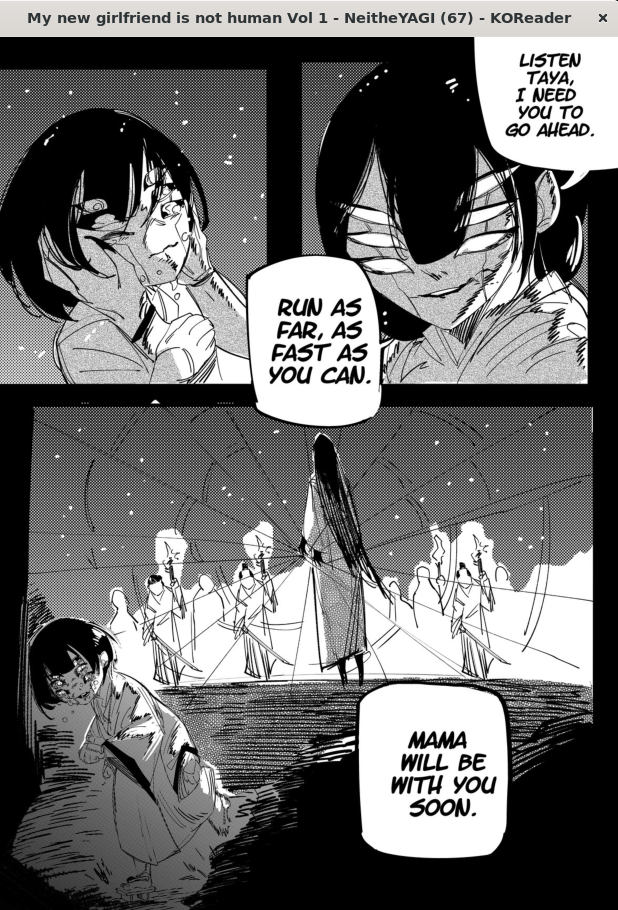

# Known Limitations

## 1. Pages with intersecting speech bubbles take the whole page as one big panel.
Due to the nature of KOReader's native reader "Exact Mode", and (initially) in the search for performance, full pages with speech bubbles that intersect across multiple panels aren't zoomed into individual panels because the detector takes the whole page as a single big panel instead of cutting those panels and the main dialog bubble.

<table align="center" width="80%">
  <tr>
    <td align="center" width="50%">
      
       
      Normal View
    </td>
    <td align="center" width="50%">
      
       
      One big panel...
    </td>
  </tr>
</table>

**Why?**  
Normally the detection algorithm looks for clear panel boundaries, but when speech bubbles intersect multiple panels, the detection logic groups them all together into one large panel. In the future maybe I'll add better handling to separate them.

### When panels and dialogs are well-separated:
It works fine if the panels and speech bubbles have clear spacing between each other or they are encapsulated in their respective panels:

  
   
  Normal page (no plugin activated yet)

<table align="center" width="95%">
  <tr>
    <td align="center" width="25%">
      
       
      Panel 1
    </td>
    <td align="center" width="25%">
      
       
      Panel 2
    </td>
    <td align="center" width="25%">
      
       
      Panel 3
    </td>
    <td align="center" width="25%">
      
       
      Panel 4
    </td>
  </tr>
</table>

  With plugin zooming

---