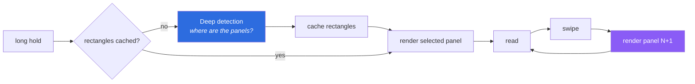
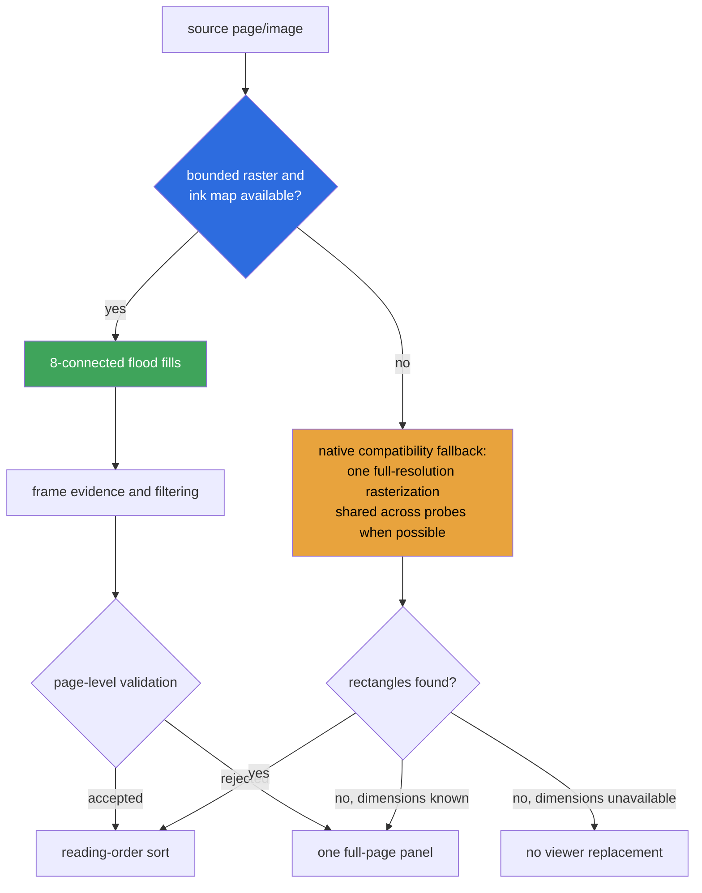

# Performance

What panel reading actually costs, where the expensive parts were, and how to
measure it on your own device.

See also: [ARCHITECTURE.md](ARCHITECTURE.md), [DETECTION.md](DETECTION.md),
[MODES.md](MODES.md) for the single Deep detection mode, and
[WORD-LOOKUP.md](WORD-LOOKUP.md) for the touch-and-hold OCR lookup costed
below.

> **On the numbers below:** the operation counts are exact — they come from
> reading KOReader's document code and counting calls. The millisecond figures
> are *not* measured; e-reader hardware varies far too much for a number quoted
> here to mean anything on your device. Use
> [Measuring on your device](#measuring-on-your-device) to get real ones.

## The two costs

Panel reading spends its time in exactly two places, and they are worth keeping
separate because they are felt at different moments.



**Detection** is paid once per uncached page, either after the long hold or in a
background prefetch.
**Panel rendering** is paid on every swipe and is felt as the viewer being sticky.
Both were slow, for unrelated reasons, which is why the delay seemed to move
around.

## Detection

Deep mode normally performs one bounded page render and one component pass:



- **The primary component pipeline** ([DETECTION.md](DETECTION.md)) uses one
  render at `segment_target_width` (480px). The classification and flood fill
  are linear in the resulting map area and use reusable FFI buffers.
- **The native fallback is exceptional.** It runs only when the reduced map
  cannot be built, not when a valid component result is merely imperfect.
- **Batching** moves the probe loop inside one full-resolution rasterization on
  that fallback path. If batching fails its self-check, KOReader's original
  per-probe entry point is the final compatibility path.

## Panel rendering

Every panel switch used to run three things back to back:

| Step | Cost |
| --- | --- |
| `drawPagePart()` | mupdf rasterizes the panel region, scaled up to fill the screen |
| `image:copy()` | a screen-sized blitbuffer copy |
| `collectgarbage()` | **a full GC cycle, on every swipe** |

The `collectgarbage()` was the clearest waste. The `image:free()` immediately
above it already releases the blitbuffer's C memory; the collection only walked
the entire Lua heap to reclaim a handful of small tables, and its cost scales
with total heap size rather than with anything being freed. It is gone.

`drawPagePart()` is real work and cannot be removed — but it can be moved off the
critical path. After a panel is shown, the *next* panel's tile is rendered during
idle time, so the swipe finds it in `DocCache`:

```mermaid
sequenceDiagram
    participant U as User
    participant V as PanelViewer
    participant VC as ViewerController
    participant DOC as Document
    participant D as DocCache

    U->>V: swipe to panel N
    V->>DOC: lazy crop calls drawPagePart(panel N)
    DOC->>D: request rendered tile
    alt tile was warmed
        D-->>DOC: cache hit
    else no warmed tile
        D-->>DOC: render and cache tile
    end
    DOC-->>V: panel bitmap
    V-->>U: panel N shown
    V->>VC: requestPanelPrerender(N)
    Note over VC: wait panel_prerender_delay
    alt prerender enabled, next panel exists, and memory is sufficient
        VC->>DOC: drawPagePart(panel N+1)
        DOC->>D: render/cache tile
        DOC-->>VC: buffer, then discard plugin reference
        Note over D: tile stays cached;<br/>plugin owns nothing
    end
```

The rendered buffer is deliberately thrown away. `DocCache` already owns the
tile and already knows the device's memory budget; keeping a second copy would
spend exactly the memory this is meant to protect.

## Word lookup (touch-and-hold OCR)

A refined word selection on an unblocked zoomed panel pays for two things, both
scoped to that one word, not the whole page: a small crop render around the tap
(`src/_wordfinder.lua`'s `CROP_HALF_W_FRAC`/`CROP_HALF_H_FRAC`, at 2x zoom)
and a Tesseract OCR call over the resulting tight box, with one retry on a
padded box if the first result doesn't look like a plausible word. Both are
orders of magnitude cheaper than a full-page detection pass, but Tesseract
itself keeps a cached `OCREngine` (with its loaded DAWGs) alive in
`DocCache` between lookups — `WordFinder.cleanup()` evicts it on viewer
close so it doesn't outlive the document. See
[WORD-LOOKUP.md](WORD-LOOKUP.md) for the full pipeline.

**OCR debug review mode** (off by default) adds real cost on top of a normal
lookup when enabled: a second, larger crop render (`IMAGE_ZOOM = 4.0`) to
burn in the OCR/user boxes, a PNG write per reviewed entry, and one append
to `OCR.debug.session.log`. It exists for building a labeled dataset, not
for everyday reading — leave it off otherwise.

## Memory

The plugin is built to add as little resident memory as possible, because
`DocCache` sizes itself from free memory — on a device with little of it,
KOReader's own cache shrinks to a single slot and every render becomes a miss.
Anything Panels+ holds makes that worse.

| What | Lifetime | Size |
| --- | --- | --- |
| Panel rectangle lists | `panel_cache_pages` (12) pages | ~a few hundred bytes per page |
| Ink map | during detection only | ~340KB, then collected |
| Component scratch buffers | while document open, freed on close | ~5.8MB FFI arrays (reused across all pages) |
| Greyscale copy (colour pages only) | during detection only | ~340KB, freed immediately |
| Native fallback KOPT/Leptonica buffers | one compatibility attempt | Full-source-size, manually freed and budget-gated |
| Panel image list | while the viewer is open | render *functions*, not bitmaps |
| Current panel bitmap | one at a time | one screen-sized buffer |
| Prerendered tile | owned by `DocCache` | not the plugin's |

Deliberate choices behind that table:

- **Panel images stay lazy.** `buildImages()` stores closures. Opening a 9-panel
  page renders one panel, not nine.
- **The plugin still copies the current panel** rather than using KOReader's
  `image_disposable = false`. Upstream can point `ImageViewer` straight at a
  cached tile because it only ever holds one panel; Panels+ prefetches, and
  `DocCache` frees evicted tiles immediately via its eviction callback, so a
  borrowed tile could be freed underneath the viewer.
- **Prerendering yields under pressure.** If `util.calcFreeMem()` reports less
  than `prerender_min_free_bytes` (40MB) available, the warm-up is skipped and
  behaviour degrades to rendering on demand.
- **Native detection yields under pressure too.** Below
  `native_detect_min_free_bytes` (100MB) free, both the single shared-context
  render and its up-to-29-render per-probe fallback are skipped outright and
  the page is treated as having no panels, rather than risking an OOM kill on
  what is this plugin's single largest allocation.
- **Native fallback reserves its real working set.** The fixed floor alone is not enough:
  Panels+ estimates the KOPT source and Leptonica temporary images from the
  current page/image dimensions, and runs the fallback only when both that
  estimate and the safety floor fit. This is deliberately conservative on
  300MB devices.
- **Embedded boundary searches drop the old source first.** The current crop
  stays visible, but the decoded bitmap and its lazy crop closures do not
  survive while later EPUB/KEPUB/MOBI pages are searched. Queued search callbacks are
  invalidated when the viewer or document closes.
- **Scheduled work is cancellable.** Prefetch jobs and the prerender job are held
  by handle and unscheduled on cache clear and on close, so closures do not keep
  a closed document alive.

## Measuring on your device

Enable **Panels+ → Enable debugging logs**, reproduce the slowness, then read
KOReader's log (`crash.log`, next to your KOReader directory). Every line
you'll find there is prefixed `[Panels+]`, so you can grep/filter it out from
KOReader's own logging.

A normal Deep-mode page:

```
[Panels+] page bitmap 74ms (480x720 bb8 bg=247 ink=22%)
[Panels+] prerender panel 2 88ms
```

A page whose reduced bitmap was unavailable and used the internal fallback:

```
[Panels+] native detect 810ms (6 panels from 29 probes, 1 page render)
```

What the numbers tell you:

| Observation | Meaning |
| --- | --- |
| `page bitmap` dominates | The small render is the cost. Lower `segment_target_width` |
| `native detect` appears often | The reduced map could not be built; check document reflow/page optimization and render failures |
| `per-probe renders` in the native line | The batching self-check failed and the slow path is in use. Worth reporting |
| `native detect skipped: low memory` | Free memory was under `native_detect_min_free_bytes`; the page is reported as having no panels |
| `native detect fallback skipped: low memory after batched failure` | The shared-context render failed and memory was too tight to retry with the per-probe fallback |
| No `prerender` lines | Prerendering is off, or free memory is under `prerender_min_free_bytes` |

Leave the setting off for normal reading; it writes a few lines per page.

## Checking memory behaviour

Free memory should be flat across a long reading session. On a device with
`/proc`:

```sh
grep MemAvailable /proc/meminfo   # before
# read 30 pages with the panel viewer open
grep MemAvailable /proc/meminfo   # after
```

A steady decline means something is not being released — a leaked `KOPTContext`
or blitbuffer — and is a bug worth reporting rather than a tuning matter.
