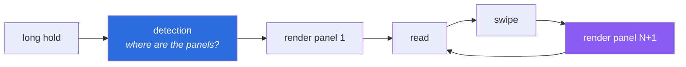
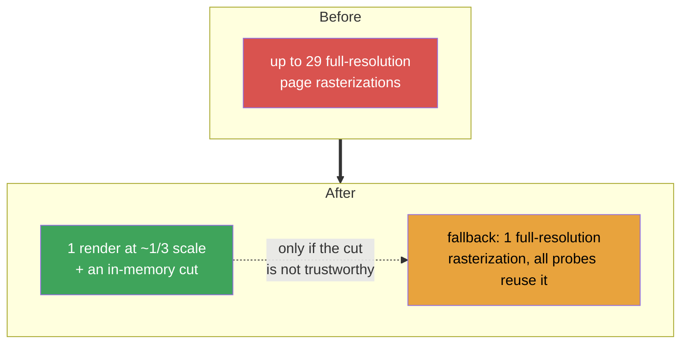
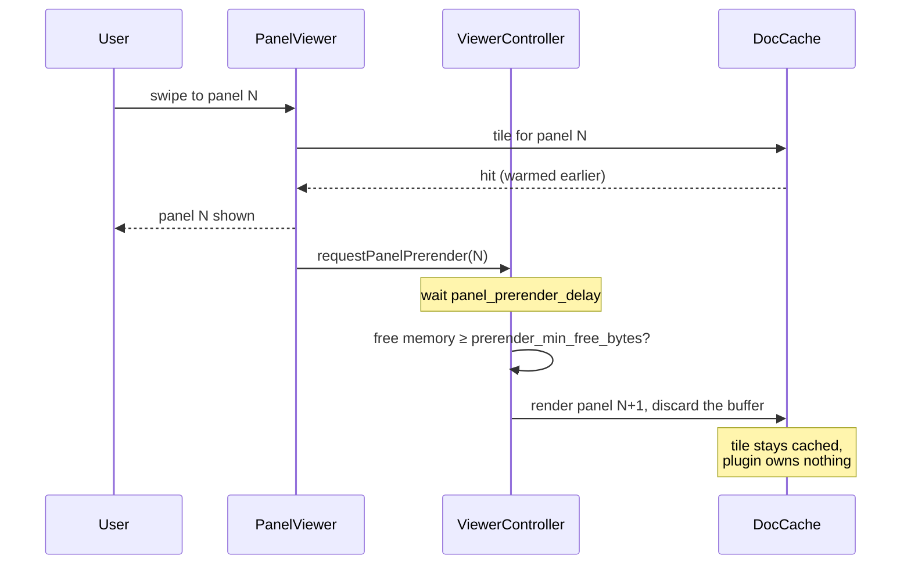

# Performance

What panel reading actually costs, where the expensive parts were, and how to
measure it on your own device.

See also: [ARCHITECTURE.md](ARCHITECTURE.md), [DETECTION.md](DETECTION.md).

> **On the numbers below:** the operation counts are exact — they come from
> reading KOReader's document code and counting calls. The millisecond figures
> are *not* measured; e-reader hardware varies far too much for a number quoted
> here to mean anything on your device. Use
> [Measuring on your device](#measuring-on-your-device) to get real ones.

## The two costs

Panel reading spends its time in exactly two places, and they are worth keeping
separate because they are felt at different moments.



**Detection** is paid once per page and is felt as a delay after the long hold.
**Panel rendering** is paid on every swipe and is felt as the viewer being sticky.
Both were slow, for unrelated reasons, which is why the delay seemed to move
around.

## Detection

`KoptInterface:getPanelFromPage` is the only uncached probe in KOReader's
`KoptInterface` — every sibling (`getAutoBBox`, the text-box probes) stores its
result in `DocCache`, and this one does not. Each call:

1. builds a `KOPTContext`,
2. opens the page,
3. **rasterizes the whole page at full resolution** (`page:getPagePix`),
4. probes one point,
5. throws the rasterization away.

The probe plan is `panel_grid_cols × panel_grid_rows` = 4 × 7, plus the hold
point. Probes landing inside an already-found panel are skipped, but probes
landing in gutters and margins return nothing, are not recorded, and pay in full.

| Page | Full-resolution page renders, before |
| --- | --- |
| Few large panels | ~6–10 (most probes suppressed) |
| Many small panels | up to 29 |
| Wide margins | up to 29 (margin probes never suppress anything) |

That spread is why the stall was 3–4 seconds on some pages and barely noticeable
on others. Two changes address it:



- **The segmenter** ([DETECTION.md](DETECTION.md)) replaces probing entirely on
  the common path. One render at `segment_target_width` (480px) is roughly 1/11th
  the pixels of a full-resolution page, and the cut that follows is integer
  arithmetic over a ~340KB byte map.
- **Batching** moves the probe loop *inside* the rasterization on the fallback
  path, so even a page the segmenter declines costs one page render rather than
  up to 29.

## Panel rendering

Every panel switch used to run three things back to back:

| Step | Cost |
| --- | --- |
| `drawPagePart()` | mupdf rasterizes the panel region, scaled up to fill the screen |
| `image:copy()` | a screen-sized blitbuffer copy |
| `collectgarbage()` | **a full GC cycle, on every swipe** |

The `collectgarbage()` was the clearest waste. The `image:free()` immediately
above it already releases the blitbuffer's C memory; the collection only walked
the entire Lua heap to reclaim a handful of small tables, and its cost scales
with total heap size rather than with anything being freed. It is gone.

`drawPagePart()` is real work and cannot be removed — but it can be moved off the
critical path. After a panel is shown, the *next* panel's tile is rendered during
idle time, so the swipe finds it in `DocCache`:



The rendered buffer is deliberately thrown away. `DocCache` already owns the
tile and already knows the device's memory budget; keeping a second copy would
spend exactly the memory this is meant to protect.

## Memory

The plugin is built to add as little resident memory as possible, because
`DocCache` sizes itself from free memory — on a device with little of it,
KOReader's own cache shrinks to a single slot and every render becomes a miss.
Anything Panels+ holds makes that worse.

| What | Lifetime | Size |
| --- | --- | --- |
| Panel rectangle lists | `panel_cache_pages` (12) pages | ~a few hundred bytes per page |
| Ink map | during detection only | ~340KB, then collected |
| Greyscale copy (colour pages only) | during detection only | ~340KB, freed immediately |
| Panel image list | while the viewer is open | render *functions*, not bitmaps |
| Current panel bitmap | one at a time | one screen-sized buffer |
| Prerendered tile | owned by `DocCache` | not the plugin's |

Deliberate choices behind that table:

- **Panel images stay lazy.** `buildImages()` stores closures. Opening a 9-panel
  page renders one panel, not nine.
- **The plugin still copies the current panel** rather than using KOReader's
  `image_disposable = false`. Upstream can point `ImageViewer` straight at a
  cached tile because it only ever holds one panel; Panels+ prefetches, and
  `DocCache` frees evicted tiles immediately via its eviction callback, so a
  borrowed tile could be freed underneath the viewer.
- **Prerendering yields under pressure.** If `util.calcFreeMem()` reports less
  than `prerender_min_free_bytes` (40MB) available, the warm-up is skipped and
  behaviour degrades to rendering on demand.
- **Scheduled work is cancellable.** Prefetch jobs and the prerender job are held
  by handle and unscheduled on cache clear and on close, so closures do not keep
  a closed document alive.

## Measuring on your device

Enable **Panels+ → Log panel timings**, reproduce the slowness, then read
KOReader's log (`crash.log`, next to the KOReader directory). Every line is
prefixed `[Panels+]`.

A healthy page on the fast path:

```
[Panels+] page bitmap 74ms (480x720 bb8 bg=247 ink=22%)
[Panels+] segment 48ms (7 panels)
[Panels+] prerender panel 2 88ms
```

A page that fell back:

```
[Panels+] segmenter rejected: only 38% of the covered area kept
[Panels+] native detect 810ms (6 panels from 29 probes, 1 page render)
```

What the numbers tell you:

| Observation | Meaning |
| --- | --- |
| `page bitmap` dominates | The small render is the cost. Lower `segment_target_width` |
| `segment` dominates | Unusual; the cut is subdividing heavily. Lower `segment_max_depth` |
| `native detect` appears often | The segmenter is declining these pages — see the rejection reason above it |
| `per-probe renders` in the native line | The batching self-check failed and the slow path is in use. Worth reporting |
| No `prerender` lines | Prerendering is off, or free memory is under `prerender_min_free_bytes` |

Leave the setting off for normal reading; it writes a few lines per page.

## Checking memory behaviour

Free memory should be flat across a long reading session. On a device with
`/proc`:

```sh
grep MemAvailable /proc/meminfo   # before
# read 30 pages with the panel viewer open
grep MemAvailable /proc/meminfo   # after
```

A steady decline means something is not being released — a leaked `KOPTContext`
or blitbuffer — and is a bug worth reporting rather than a tuning matter.
