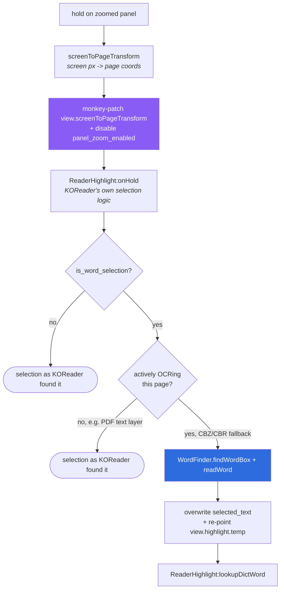
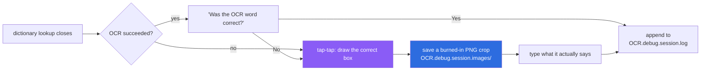

# Word lookup: text selection, dictionary, and the OCR debug review mode

How a hold on a zoomed panel turns into a highlighted word and a dictionary
popup, why comic lettering needed its own word-box finder instead of
KOReader's, and how the opt-in review mode turns a bad lookup into a labeled
example.

See also: [ARCHITECTURE.md](ARCHITECTURE.md) for how this fits into the rest
of the plugin, [PERFORMANCE.md](PERFORMANCE.md#word-lookup-touch-and-hold-ocr)
for what it costs, [KNOWN-LIMITATIONS.md](KNOWN-LIMITATIONS.md) for its
accuracy limits.

`[EXPERIMENTAL]` in the menu ("Touch & hold text selection in zoom
`[EXPERIMENTAL]`") is not decoration — turn it off if OCR misfires often on a
given book.

## Why this needed its own word finder

KOReader already has a word-box finder, tuned for prose: fairly uniform line
height, consistent inter-word gaps, one font. Comic lettering breaks all
three assumptions at once — hand-lettering, sound effects, speech-bubble
text set at odd angles or sizes, panel art bleeding into the crop around the
word. `src/_wordfinder.lua` is a from-scratch replacement built around that:
it estimates background and polarity locally (75th-percentile luminance over
a small band around the tap, so it works on inverted white-on-dark lettering
too), scopes line-height detection to a narrow column band around the tap
point instead of the whole render crop (so one line of a multi-line bubble
doesn't merge into its neighbors), and calibrates its word-gap threshold from
that specific line's own median inter-letter gap rather than a fixed
constant.

## Pipeline: hold → word box → dictionary

- **The coordinate patch is the trick that makes this work at all.**
  `ReaderHighlight:onHold` reads screen taps through
  `reader_ui.view.screenToPageTransform`, which knows nothing about a zoomed,
  panned panel crop floating in a fullscreen `ImageViewer`. `PanelViewer`
  precomputes the correct page coordinates itself
  (`PanelViewer:screenToPageTransform`, accounting for rotation and pan/zoom
  offset) and temporarily replaces that method so KOReader's own, otherwise
  untouched, hold/selection/dictionary code operates on the right point. Both
  the transform and `panel_zoom_enabled` are restored immediately after.
- **Refinement only runs where KOReader is already OCRing.** CBZ/CBR carry
  no text layer at all, so KOReader's on-the-fly OCR fallback is always in
  play there; PDF uses its embedded text layer directly and refinement is
  skipped — there's nothing to refine. The guard is
  `PageBitmap.getBlockReason(document)`, the same check reflow / page
  optimization mode uses elsewhere in the plugin.
- **The refined box has to replace two things, not one.** Overwriting
  `selected_text.sboxes`/`pboxes` fixes what the dictionary looks up,
  but `ReaderHighlight:onHold` also stashes a *reference* to the original
  box in `reader_ui.view.highlight.temp[page]`, and the on-screen underline
  is painted from `temp` in preference to the selection. Re-pointing only
  one of the two leaves a lookup that's correct with an underline that
  visibly isn't — the underline sits at KOReader's original box, which takes
  its height from the whole text *line*, not the word.

## Rendering the selection

`PanelViewer:paintHighlights` draws `view.highlight.temp[page]` (or the
selection directly) as screen rectangles via `pageToScreenTransform`, the
inverse of the transform above. A box covering ≥60% of the current panel
crop's area is treated as anomalous — a coarse or oversized OCR/text-layer
box, common on comic/manga art — and drawn as a thin outline instead of a
solid "invert" fill, so a bad box gives feedback without painting a large
black rectangle over the panel.

## OCR debug review mode

An opt-in loop (**Panels+ → OCR debug review mode**, off by default) for
building a labeled dataset of lookup mistakes, rather than something meant
for everyday reading — see
[PERFORMANCE.md](PERFORMANCE.md#word-lookup-touch-and-hold-ocr) for its
extra cost.

- **Detecting that the dictionary popup closed** is trickier than it sounds:
  `src/_ocrdebug.lua` wraps `reader_ui.dictionary.onLookupWord` for exactly
  one call, and separately polls `#UIManager._window_stack` every 0.5s (up
  to 2 minutes) as a fallback, since some dismiss paths — e.g. tap-outside on
  a "No results found" popup — never invoke the wrapped callback.
- **Rectangle capture is tap-tap, not hold-drag.** Hold-drag would collide
  with the viewer's own text-selection hold gesture and doesn't "arm"
  reliably outside a touchscreen (e.g. a mouse-driven desktop emulator).
- **The crop image never mutates a cache-owned tile.** The burned-in PNG is
  rendered fresh onto a private blitbuffer copy, with a thin (1px) outline
  for the OCR box and a thick (3px) outline for the user-drawn correct box,
  never onto anything `DocCache` still owns.
- **The log is plain JSON, one object per tap** — document, page, exact tap
  point, both boxes, native page size, both words, and a verdict. See
  `CLAUDE.md` at the repo root for the review workflow
  (`tools/ocrdebug_report.lua`) — read that file's numbers, not the images,
  for anything beyond spot-checking a specific `engine_miss`.

## Cleanup

Tesseract's `OCREngine` (with its loaded DAWGs) is cached in KOReader's
`DocCache` across lookups, cheaper than reloading per word but not something
that should outlive the document. `WordFinder.cleanup()` evicts it from
`DocCache`; it runs from `PanelViewer:onCloseWidget` on every viewer close,
guarded by `pcall` since it's teardown, not the read path.
