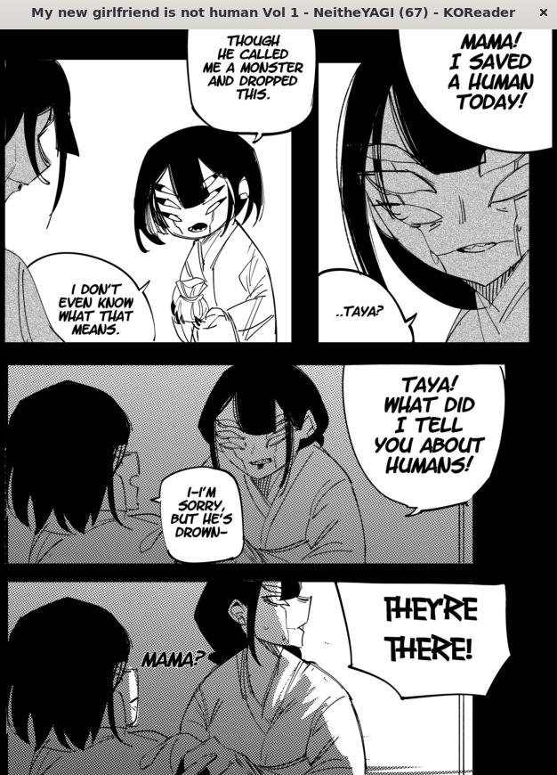
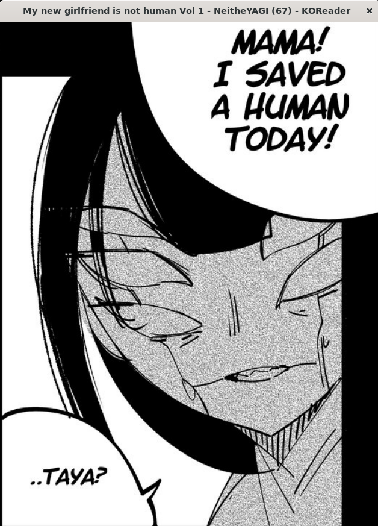
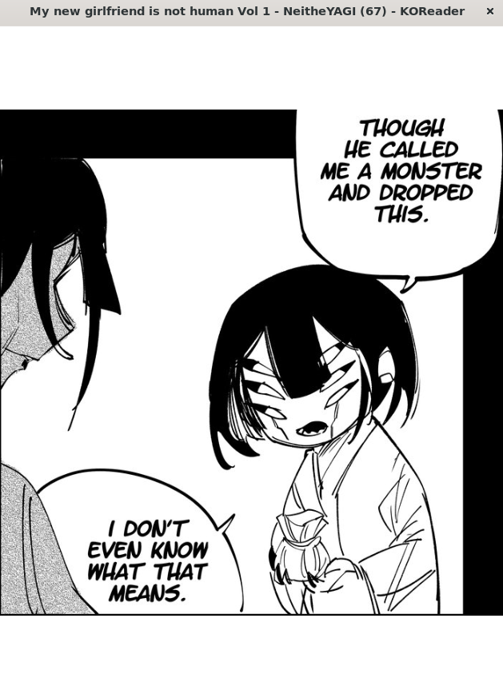
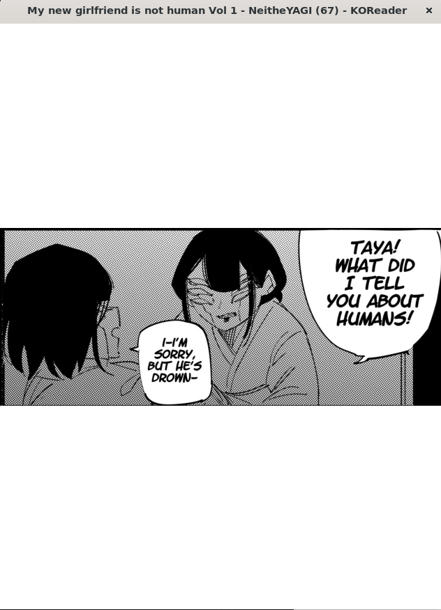
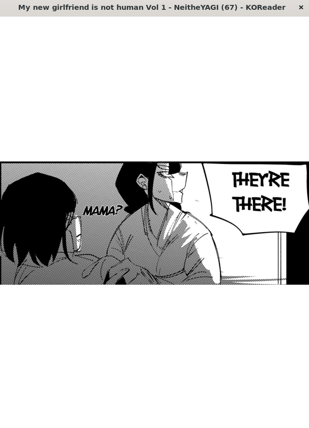
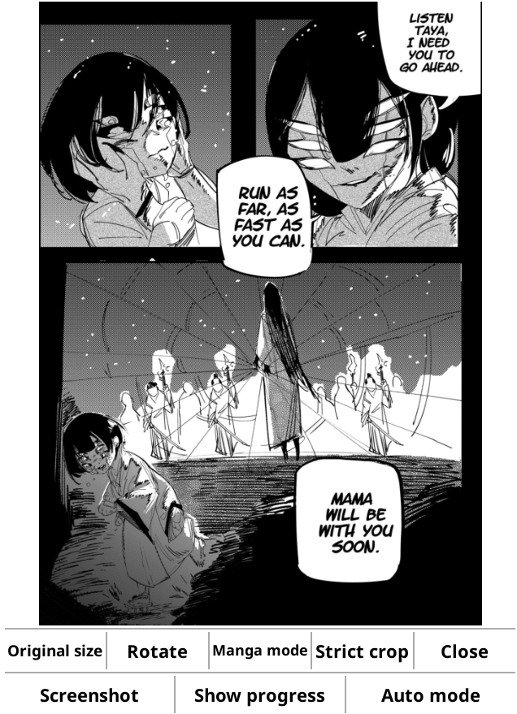

# Panels+ | Performance Update

Built from tag: `v1.0.0-RC5`

This time, the release focuses on speed and pages/panels the panel detector used to miss. Opening panel view no longer stalls for seconds in very-low-end devices (yes, I'm looking at you `Kindle`), swiping between panels is smoother, and panels are now found on dark-background pages and in rows of small panels where detection previously gave up.

## Highlights

| Feature | Description |
| :---: | :--- |
| **Feature 1** | **Panel detection on dark pages**  KOReader's detector recognizes panels by looking for *white* gaps between them, so a page printed white-on-black had nothing it could find. Panels+ now measures the page's own background colour and works from that instead, so an inverted page is detected exactly like a normal one.  
 &nbsp;&nbsp;     Left: Normal page (no plugin) &nbsp;&nbsp;&nbsp;&#124;&nbsp;&nbsp;&nbsp; Right: Zoomed panels (Panels 1–4)
 |
| **Feature 2** | **Much faster panel detection**  Opening panel view used to rasterize the whole page at full resolution *many times*. Detection is now a single reduced-size render, and the fallback path reuses one rasterization for every probe instead of one each. TL;DR: Is faster |
| **Feature 3** | **Smoother panel switching**  Every panel switch used to force a full garbage collection, which stalled the UI for longer than it reclaimed. That is gone, and the next panel is now rendered in the background while you read the current one, so swiping to it is instant (or at least should feel instant). Pre-rendering switches itself off when the device is low on memory. |
| **Feature 4** | **Choose your detector**  A new *Panel detection* menu lets you pick **Auto**, **Gutter mode**, or **Outline mode**, so a page that either one mishandles can be worked around on the spot. Gutter mode always uses the quick, gap-based detector; Outline mode always uses KOReader's own, more literal detector; Auto tries Gutter first and falls back to Outline. The mode can also be cycled from the panel viewer itself with a button. Alongside the menu are toggles for panel pre-rendering and for writing detection timings to the log. More info in [Modes.md](../MODES.md). 
    New button "Auto Mode" that cycles through <strong>Auto</strong>, <strong>Gutter</strong> & <strong>Outline</strong> when pressing 
 |

## Fixes

- Rows of small panels separated by narrow gutters are now split into individual panels instead of being returned as one. The minimum detectable gutter went from roughly 15px to roughly 7px on a 1600px-wide page.
- Panels separated by non-square or tilted gutters (up to 6 degrees) are now split using slanted line projections instead of being returned as a single grouped panel.
- Panel detection no longer re-rasterizes the full page for every probe point.
- Fixed bad page rendering handling where detector failures permanently disabled the batched fast-path session-wide, preventing high memory usage and KOReader crashes over long sessions.
- Removed the forced garbage collection that ran on every panel switch.
- Prefetch jobs scheduled for pages you have already turned past are now cancelled instead of all running anyway, and no scheduled work survives closing the document.
- The panel cache holds 12 pages instead of 2, so stepping back a page no longer re-detects it from scratch.
- Fixed the low-memory check for pre-rendering, which compared bytes against a kilobyte threshold and so never actually triggered.
- Colour pages are now converted once before scanning rather than being read pixel by pixel through the slow path.

## Documentation

This release adds a `docs/` folder describing how the plugin works, with diagrams:

- [Architecture](../ARCHITECTURE.md) — module map and what happens between a long hold and a panel on screen.
- [Panel detection](../DETECTION.md) — how panels are found, why there are two detectors, and every tuning knob.
- [Detector modes](../MODES.md) — reader-facing guide to Auto, Gutter, and Outline modes and how to diagnose misread pages.
- [Performance](../PERFORMANCE.md) — what each step costs, the memory budget, and how to measure it on your own device.

## Included Commits

- `3c01185` perf(detector): probe a whole page against one rasterization
- `c3b1fe6` feat(detector): detect panels from a low-resolution ink map
- `ddcc5a8` perf(viewer): stop forcing a full GC and warm the next panel
- `681e382` fix(cache): cancel stale prefetch work and keep more pages
- `0a50b89` feat(menu): expose detector choice, prerender and timing logs
- `5788415` docs: document the panel pipeline, detection and performance
- `c5e26fe` fix(viewer): compare prerender headroom in bytes, not kilobytes
- `3046f4d` perf(detector): sample the ink map from a greyscale buffer
- `02eb292` docs: avoid a mermaid reserved word in the module diagram
- `3c57e00` fix(detector): split panel rows separated by narrow gutters
- `30c7550` fix(detector): split panels whose gutters are not square
- `f25541b` feat(viewer): cycle Auto, Fast and Exact mode from the panel view
- `bb8fe6a` docs: cover tilted gutters and the viewer mode button
- `3880511` refactor(viewer-ui): Better names in new ui option
- `62db13f` fix: Fixed bad page rendering handling making crash koreader over time
- `42b5eb1` docs: Updated docs
- `ebd4683` chore(git): ignore vendored koreader reference tree

## Upgrading

Copy `panels_plus.koplugin` over your existing folder and restart KOReader. Your settings are kept; the detector and cache values tuned in this release are applied automatically.

## Author

- KristanLaimon
